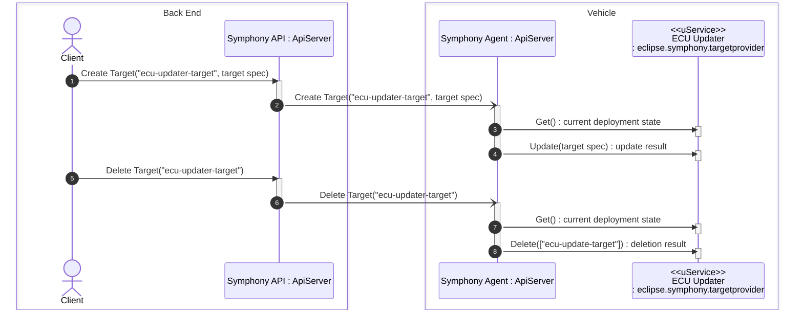
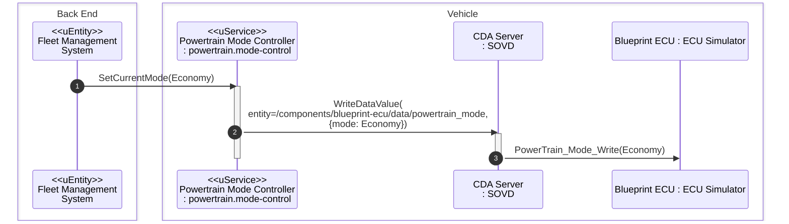

# Commercial Vehicle Use Cases based on Eclipse SDV Software Components

This repository contains artifacts that implement a few use cases that are (not exclusively) relevant for commercial vehicles.
The artifacts have been implemented using open source components created by the Eclipse SDV community and other projects.

Use cases currently include:
* Over-the-Air (OTA) firmware updates of ECUs
* OTA configuration changes of ECUs

## Top Level View

The following diagram provides an overview of the components used for the example use cases and their relationship to each other:


## Getting Started

The repository contains a [Docker Compose file](docker-compose.yaml) which can be used to start up all
components implementing the example use cases:

```bash
# Using the default Docker Compose file in the top level folder:
docker compose up -d
# Or if your docker-compose.yaml file is located in a different folder:
# docker compose -f /path/to/your/docker-compose.yml up -d
```

Now you can open Dozzle in your browser at http://localhost:8080 and verify that all components are up and running and inspect their log output.

### Verify Access to Services

* To check access to Symphony's REST API, you can send a test request by opening http://localhost:8082/v1alpha2/greetings in your browser.
  The response should be: `Hello from Symphony K8s control plane (S8C)`
* To check access to the read-only Symphony Portal, point your browser to http://localhost:3000.
  Login with user `admin` without a password. You should see the Symphony portal page.
  During your experiments, the portal can used to determine the progress of updates by means of checking the _Targets_.

## Run the Deploy Firmware Use Case

Now that the infrastructure is up and running, it is time to trigger the update of some ECU firmware images using the Symphony API:

```bash
# From the repository root folder
scripts/trigger_ecu_update.sh
```

This will create a new _Target_ in Symphony and deploy two firmware files to it:

* The logs of the `ecu-updater` container should contain something similar to

  ```log
  [2026-06-01T14:26:29Z INFO  ecu_updater::ecu_target] installing firmware [name: Engine Controller, FW Image: "https://acme.io/fw/engine-control-1.45.img"]
  [2026-06-01T14:26:29Z INFO  ecu_updater::ecu_target] installing firmware [name: Telematics Unit, FW Image: "https://non-existent.io/fw/telematics-unit-2.0.img"]
  ```

* A corresponding entry should show up under the _Targets_ tab in the Symphony Portal web UI.

After hitting _Enter_ in the terminal where you ran the shell script:

* The firmware files will be removed from the target.
  In the logs of the `ecu-updater` container, you should see something similar to:

  ```log
  [2026-06-01T14:26:53Z INFO  ecu_updater::ecu_target] removing firmware [Engine Controller]
  [2026-06-01T14:26:53Z INFO  ecu_updater::ecu_target] removing firmware [Telematics Unit]
  ```
* The _ecu-updater-target_ in Symphony will be removed after a few seconds.

The sequence diagram below shows the flow of messages through the system for triggering the firmware update:



1. The _Client_ uploads a new target deployment specification by means of an HTTP POST request to the _Symphony API_ server in the back end. The target specification contains the details of the firmware images to be updated.
2. The _Symphony API_ server forwards the target spec to the _Symphony Agent_ running on the vehicle by means of an MQTT message.
3. The _Symphony Agent_ determines the current deployment status of the _ECU Updater_ deployment target by means of invoking its _Get_ operation via uProtocol.
4. The _Symphony Agent_ triggers the installation of the firmware by means of invoking the _Update_ operation with the changed components of the target specification via uProtocol.

**Note** The ECU Updater in this example use case does not actually deploy any firmware images to any ECU but only maintains some state in memory. In a future extension of the blueprint, the OpenSOVD CDA server might be used to actually perform an ECU update via UDS.

## Run the Update ECU Configuration Use Case

In this use case, a Fleet Management System in the backend uses the _Powertrain Mode Controller_ uService on the vehicle to cycle the vehicle's powertrain through all supported modes.

For this purpose, the Powertrain Mode Controller invokes the Powertrain ECU's _PowerTrain_Mode_Write_ UDS operation by means of [Eclipse OpenSOVD's Classic Diagnostic Adapter](https://github.com/eclipse-opensovd/classic-diagnostic-adapter) (CDA) component.
The CDA exposes an HTTP based API that can be used by clients to interact with ECUs via UDS over DoIP.

The Powertrain ECU is represented by a modified version of the ECU Simulator component that is part of OpenSOVD's test infrastructure. In particular, it has been modified to expose a _PowerTrain_Mode_Read_ and a _PowerTrain_Mode_Write_ operation.

The Fleet Management Service is started automatically by Docker Compose. The setting of the powertrain mode can be traced through the system by means of the container logs:

* The log file of the Fleet Management System contains entries like these:
  ```log
  [2026-06-02T09:12:14Z INFO  fms] setting powertrain mode to Economy
  ...
  [2026-06-02T09:12:19Z INFO  fms] setting powertrain mode to Performance
  ```
* The log file of the Powertrain Mode Controller contains entries like these:
  ```log
  [2026-06-02T09:13:25Z INFO  powertrain] Setting current powertrain mode to SOVD server at http://sovd-cda:20002/vehicle/v15/components/blueprint-ecu/data/powertrain_mode
  [2026-06-02T09:13:25Z INFO  powertrain] Powertrain mode set to: Economy
  ```
* The log file of the ECU Simulator contains entries like these:
  ```log
  Set PowerTrain Mode: 2
  09:13:25.536 DEBUG [DefaultDispatcher-worker-10] SimEcu blueprint-ecu Request for blueprint-ecu: '2E 4E 66 02' matched '{ PowerTrain_Mode_Write; Bytes: 2E 4E 66 [] }' -> Send response '6E 4E 66'
  ```

The sequence diagram below shows the flow of messages for setting the current mode on the powertrain ECU:



1. The _Fleet Managament System_ sets the powertrain mode to _Economy_ by means of a uProtocol RPC call to the _Powertrain Mode Controller_.
2. The _Powertrain Mode Controller_ sets the powertrain mode to _Economy_ by updating corresponding SOVD entity's data value by means of an HTTP PUT request on the _CDA Server_.
3. The _CDA Server_ sets the powertrain mode to _Economy_ by means of invoking the _Powertrain_Mode_Write_ operation on the _Blueprint ECU_ via UDS.

### What's in the Box?

The Docker Compose file starts up the following components:

- The `ecu-sim` service is a basic DoIP-connected ECU simulation built on the [doip-sim-ecu framework](https://github.com/doip-sim-ecu). It acts as the southbound conterpart for the classic-diagnostic-adapters diagnostic communication.
- The `sovd-cda` service is in essence an SOVD-to-UDS bridge. It uses ODD/PDX diagnostic definitions (pre-processed by OpenSOVD [odx-converter](https://github.com/eclipse-opensovd/odx-converter)) to populate its SOVD API, mapping those resources to corresponding UDS communication with connected ECUs (via DoIP).
- The `powertrain-mode-controller` service is a uProtocol entity that exposes a _setCurrentMode_ operation that can be used by other uProtocol entities to set the vehicle's powertrain mode.
- The `fms` service is a uProtocol entity that represents a Fleet Management System running in the back end. The service periodically invokes the _setCurrentMode_ operation to toggle the powertrain's mode of operation between _Economy_ and _Performance_.

The repository also contains the [odx](odx/) directory, which is a copy of the OpenSOVD Classic Diagnostic Adapter testcontainer, containing Python scripts for generating example ODX data using the [odxtools](https://github.com/mercedes-benz/odxtools) library.

### Modifications

This project copy of the upstream CDA testcontainer is modified to better represent the uServices PoC use cases, by:

- creating appropriately named ODX service definitions (by modifying the odx generation scripts)
- implementing the ecu-sim counterpart to these services (by modifying the ecu-simulation code)

### Service APIs

- SOVD API: http://localhost:20002/vehicle/v15
- ECU Simulator Control API: http://localhost:8181

#### Example Requests

```sh
ACCESS_TOKEN=$(curl -s -X POST -H "Content-Type: application/json" --data '{"client_id":"test", "client_secret":"secret"}' "http://localhost:20002/vehicle/v15/authorize" | jq -r .access_token)

# retrieve standardized resource collection for ECU (+ variant)
curl -s -X GET -H "Authorization: Bearer $ACCESS_TOKEN" "http://localhost:20002/vehicle/v15/components/blueprint-ecu" | jq .

# force variant detection
curl -s -X PUT -H "Authorization: Bearer $ACCESS_TOKEN" "http://localhost:20002/vehicle/v15/components/blueprint-ecu"

# acquire component lock
curl -s -X POST -H "Authorization: Bearer $ACCESS_TOKEN" -H "Content-Type: application/json" --data '{"lock_expiration": 100000}' "http://localhost:20002/vehicle/v15/components/blueprint-ecu/locks"

# switch into extended session
curl -s -X PUT -H "Authorization: Bearer $ACCESS_TOKEN" -H "Content-Type: application/json" --data '{"value": "extended"}' "http://localhost:20002/vehicle/v15/components/blueprint-ecu/modes/session"

# switch sim to boot variant
curl -s -X PUT -H "Content-Type: application/json" --data '{"variant": "BOOT"}' "http://localhost:8181/blueprint-ecu/state"

```
